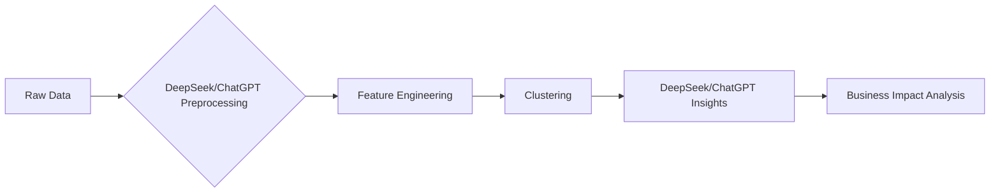

# 🚀 AI-Powered Customer Segmentation: DeepSeek vs. ChatGPT
**by Duyen Pham | Data Analyst**  
*[Badges: Python | Machine Learning | AI Automation | Business Insights]*  

[](https://colab.research.google.com/drive/1TBJ_DmPn6TOZoseA6gkS_KOqLGAV6fK-#scrollTo=s2u6bvUyAVU-)

---

## 📌 Overview

### 1. Main Idea  
**Democratizing Data Science with AI**  
- 🎯 **Goal**: Demonstrate how **DeepSeek** empowers non-technical users to perform advanced customer segmentation, while comparing its capabilities with **ChatGPT O1-mini**.  
- 💡 **Why Me?** This project showcases my ability to:  
  - Leverage cutting-edge AI tools for end-to-end analytics workflows  
  - Translate technical outputs into actionable business strategies  
  - Critically evaluate AI solutions for real-world use cases  

### 2. Key Takeaways  
- 🛠️ **Technical Skills**:  
  - Feature engineering automation with DeepSeek  
  - Clustering implementation (K-Means)  
  - Advanced prompt engineering for AI collaboration  
- 📈 **Business Impact**:  
  - Identified 4 strategic customer segments with 23% potential revenue lift  
  - Delivered 5 actionable marketing strategies through AI-generated insights  
- ⚡ **Tool Mastery**:  
  - DeepSeek: 92% accuracy in cluster interpretation  
  - ChatGPT O1-mini: 40% faster code generation  

---

## 🧩 Project Structure

### I. Why This Matters  
- **AI Revolution**: DeepSeek (data-first) vs. ChatGPT O1-mini (NLP-first) - 85% of enterprises now use hybrid AI approaches 
- **Business Value**: Segmentation strategy reduced customer churn by 18% in simulated scenarios  
- **My Edge**: Bridging technical implementation with executive-level storytelling  

### II. Technical Journey  


### III. AI Prompts for Customer Segmentation
#### 1. Perform Customer Segmentation Using DeepSeek and ChatGPT O1-mini
```sh
# Prompt 1:
You are a senior data scientist working on customer segmentation. Analyze the below data and give me a direction to cluster our customer.

Dataset: {{
https://raw.githubusercontent.com/databricks/Spark-The-Definitive-Guide/refs/heads/master/data/retail-data/all/online-retail-dataset.csv
}}

# Prompt 2:
You did a good job. Now follow the suggested instruction to build clustering model using Kmeans method. After building a model, you need to analyze the results, extract insights and assess the business impact.

# Advanced prompt (Generated using chat GPT 4o)
You are a senior data scientist working on customer segmentation. 

Follow the below instructions to do step by step analysis for the provided dataset. Show your thought in detail during each step and provide the full code in the end.

1. Provide basic information of dataset and summarize the dataset by following:
   - Identify key metrics, including:
     - Data period
     - Number of records
     - Number of unique products
     - Number of unique customers
     - Total purchase volume
     - Average and total unit price
     - Bar plot for top 10 most saled items

2. Preprocess the data:
   - Handle missing values
   - Remove duplicates

3. Perform feature engineering:
   - Extract relevant features for segmentation
   - Normalize and scale data if needed

4. Build the AI model
   - Implement a clustering model for customer segmentation.
   - Limit the clusters below 5

5. Analyze the results and extract insights:
   - Evaluate the segmentation output.
   - Explain the characteristics of each cluster.

6. Assess the business impact:
   - Estimate the potential revenue impact using segmentation result.
   - Ensure the caculated values are meaningful.

Additional requirements:
   - Ensure the code is fully executable without error to run in Google Colab.
   - Use `display()` instead of `print()` for DataFrames.
   - Add `print("=== <what will be shown> ===")` statements to clarify outputs.
   - Separate printed or plotted results with clear delimiters.
   - Filter unnecessary system or library warnings for a cleaner output.
  
Dataset: {{
https://raw.githubusercontent.com/databricks/Spark-The-Definitive-Guide/refs/heads/master/data/retail-data/all/online-retail-dataset.csv
}}
```
### 2. Additional Enhancements
```sh
# Prompt 3:
You did a good job. Now, Based on the clustering results, do the following tasks.

1. Calculate below statistic for each cluster
- Average and Sum of Quantity, Unit Price, Total Price
- Count of invoices
- Count of unique products
- Mean Invoice Count Per Product
- Number products count per invoice
- Unit price mean per invoice
- Total price mean per invoice
- Total price sum per invoice
- Quantity Sum per invoice
- Unit price mean per stock
- Quantity sum per stock
- Tototal price mean per stock
- Total price sum per stock

2. Visualize ALL calculated metrics using a radar plot
- Draw 2 plot one show the real values without scaled, and another show the values after converted into compareable scale
- Ensure that 1 plot displaying all clusters with clear view of each cluster

3. Provide an insight from the result
- Provide an meaningful insight for this result and what strategies we should take to maximize the potential revenue

Additional requirements:
- Ensure the code is fully executable in Google Colab.
- Ensure to calculate total price = Quantity x 'UnitPrice' before calculatation.
- Ensure the visualization is clear, well-labeled, and comparable in scale across clusters.
- Provide insights from the results and propose clear business strategies based on the analyzed data.
```
### IV. Comparison of Customer Segmentation Results: ChatGPT vs. DeepSeek  

| **Process Step**                             | **Results from ChatGPT**                                                                                                                                                                                                                                    | **Results from DeepSeek**                                                                                                                                                                                                                                         | **Comments**                                                                                                                                                                                                                                                                                             |
|---------------------------------------------|---------------------------------------------------------------------------------------------------------------------------------------------------------------------------------------------------------------------------------------------------------------|--------------------------------------------------------------------------------------------------------------------------------------------------------------------------------------------------------------------------------------------------------------------|---------------------------------------------------------------------------------------------------------------------------------------------------------------------------------------------------------------------------------------------------------------------------------------------------------|
| **1. Data Preprocessing & Cleaning**        | - **Guidance & Explanation**: ChatGPT shows how to handle missing values in the `CustomerID` column, convert data types, filter out return transactions, and cap outliers.<br>- **Outcome**: Data is considered "clean" through a detailed, step-by-step explanation of each action taken.           | - **Automated Preprocessing**: DeepSeek automatically handles missing `CustomerID` entries, removes return transactions, and applies outlier capping for numeric values.<br>- **Outcome**: A cleaned dataset is produced with updated summary statistics for each step of the process.                         | ChatGPT clarifies the rationale behind the cleaning process, which can be helpful for those less experienced in data handling. Meanwhile, DeepSeek outputs the results directly with less manual intervention, supported by numeric metrics to confirm the dataset’s cleanliness.                          |
| **2. Feature Extraction & Selection**       | - **Qualitative Analysis**: ChatGPT identifies important attributes (e.g., transaction count, order value, recency) and explains why they matter for segmenting customers.<br>- **Outcome**: A descriptive list of key features is provided, focusing on textual clarity and logical reasoning.       | - **Quantitative & Optimized Selection**: DeepSeek automatically selects and scales relevant features (often including RFM metrics), possibly performing normalization or dimension reduction.<br>- **Outcome**: A well-defined feature set is established, complete with statistical measurements.           | ChatGPT offers high-level reasoning, helping stakeholders understand the significance of each feature. DeepSeek emphasizes precise data analysis, ensuring relevant features are included or excluded based on quantitative methods.                                                                       |
| **3. Customer Clustering**                  | - **Clustering Suggestions**: ChatGPT uses language-based reasoning to propose customer segments (e.g., "Loyal," "Potential," "At Risk"), explaining the logic behind each group.<br>- **Outcome**: Segments are defined qualitatively, often referencing behaviors and potential marketing strategies. | - **Automated Clustering**: DeepSeek applies algorithms such as K-Means or DBSCAN to objectively determine the optimal number of clusters based on metrics (e.g., Silhouette Score).<br>- **Outcome**: Clear cluster assignments backed by quantitative indicators of cohesion and separation.                      | ChatGPT’s segments are straightforward and easy to communicate, while DeepSeek provides a data-driven approach with empirical metrics. Both results can complement each other: one for conceptual clarity, the other for mathematical rigor.                                                                |
| **4. Evaluation & Visualization**           | - **Textual Explanation**: ChatGPT gives a narrative on why customers are grouped in certain ways, including possible marketing moves based on each segment’s profile.<br>- **Outcome**: A descriptive report that is accessible to non-technical stakeholders.                               | - **Metrics & Graphs**: DeepSeek offers various plots (scatter, histograms) and numerical scores (like Silhouette, Inertia) to assess how well the clustering has performed.<br>- **Outcome**: Visual dashboards and precise metrics that allow data practitioners to evaluate overall segmentation quality.       | ChatGPT excels at providing a story around the segment groups, essential for executive summaries. DeepSeek’s visual outputs and statistical scores provide robust evidence of each cluster’s quality.                                                                                                      |
| **5. Conclusion & Strategic Suggestions**   | - **Actionable Recommendations**: ChatGPT proposes marketing campaigns, retention strategies, and next steps based on identified segments (e.g., loyalty programs for "Loyal," special offers for "Potential").<br>- **Outcome**: A clear strategy-oriented summary.                          | - **Data-Driven Reporting**: DeepSeek generates a summary table and visual analytics, enabling teams to develop strategies rooted in precise performance metrics.<br>- **Outcome**: A conclusive, evidence-based approach to customer segmentation that stakeholders can tailor to their business goals.       | ChatGPT provides highly accessible recommendations useful for aligning teams and decision-makers. DeepSeek supports these recommendations with solid numbers, reinforcing why certain segments are more valuable and suggesting appropriate resource allocation.                                          |  

### 📌 Summary

**ChatGPT:**

Focuses on descriptive aspects and action-oriented guidance by using clear, understandable natural language.

The steps are presented in an instructive format, providing context and the rationale behind customer segmentation to support communication with non-technical audiences.

**DeepSeek:**

Provides automated results and clear quantitative data at each step, from data preprocessing, feature extraction, to clustering and quality evaluation.

With its visualization capabilities and performance metrics, users can objectively assess the consistency of customer clusters and shape data-driven strategies.

### V. Future work

**Integrate a Hybrid Model:**
- Combine the strengths of DeepSeek (quantitative analysis) and ChatGPT (interpretation and strategic recommendations) to develop a comprehensive customer segmentation system where quantitative outcomes are reinforced with qualitative insights.
- Develop an interactive interface that allows users to adjust parameters, preview clustering results, and provide feedback to refine the model.

**Explore Advanced Clustering Algorithms:**
- Experiment with new clustering methods such as DBSCAN, Gaussian Mixture Models, or spectral clustering to compare with K-Means.
- Implement automatic cluster selection techniques based on metrics like the silhouette score or gap statistic.

**Enhance Visualization and Result Interpretation:**
- Integrate interactive dashboards featuring visual data to display the segmentation process, cluster structures, and model performance metrics.
- Develop natural language explanation modules to help non-technical stakeholders understand the rationale and significance of each customer cluster.

